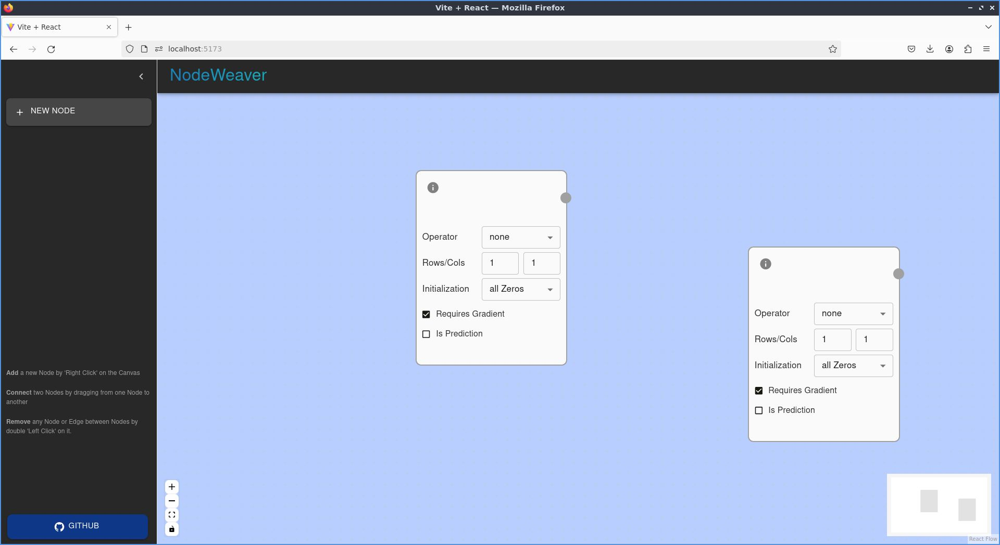

# ROSFlow NodeWeaver

ROSFlow NodeWeaver: Node based editor for robotics/ROS workflows. React based Node editor app using reactflow.

## setup / usage

### usage

```
git clone https://github.com/yojuna/ros_flow.git
cd ros_flow
```

Install dependencies via npm and start the local dev server. 
```
npm install

npm run dev
```
Goto http://localhost:5173/ for live dev version. 
Iterate and see updated changes in the browser.

### setup from scratch

Setup Conda environment with NodeJs and cd to app directory
```
conda create -n ros_flow nodejs

conda activate ros_flow

cd ~/code/repos/ros_flow/ros_flow_app
```

Create vite react app template for reactflow
```
npm create vite@latest ros_flow -- --template react

npm install reactflow
```
ref: [ReactFlow docs: Installation/setup](https://reactflow.dev/learn#installation)

Now, keep adding the required ReactFlow components and plugins as needed.

### basic app setup

Currently, started with:

- vite react template for the app
    -  [create reactflow vite template for base app](https://reactflow.dev/learn#installation)
- text box custom node
    - ref: [custom node example](https://reactflow.dev/learn/customization/custom-nodes)
- Background, Controls, and Minimap
    - ref: [reactflow examples: basic feature overview](https://reactflow.dev/examples)
- Figma like viewport controls
    - ref: [viewport examples](https://reactflow.dev/learn/concepts/the-viewport#figma-like-viewport-controls)
    - node group movable selection via left-click drag selection
    - horizontal and vertical pan on scroll
    - zoom in/out using `[ctrl]+[scroll]`
- code split into components and config files
- App rendered in `src/main.jsx`; App entrypoint defined in `src/App.jsx`

Looks something like this:




## dev notes

[5/3/24] Added home screen starting viewport with sidebar and node adding capability

### TODO

- create custom node for defining ROS Subscriber, Publisher
- custom node definition for:
    - ROS Services and Actions 
- JSON export of workspace
- Node and connection metadata preview in panel/sidebar
- custom node requirements:
    - should be able to add multiple nodes inside each new node
    